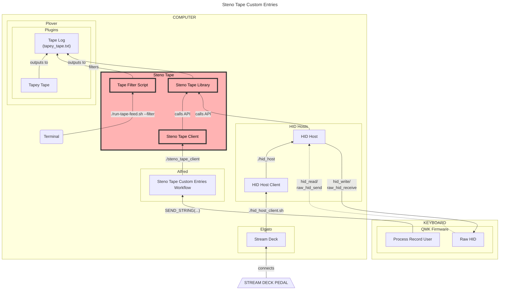

# Steno Tape

This repo contains libraries and helper code that I use to customise my
[stenography tape][] log output.

## Setup

### Clone repository

In your terminal program, use [Git][] to clone the repository from its home on
[GitHub][]:

```sh
git clone git@github.com:paulfioravanti/steno_tape.git
cd steno_tape
```

## Sections

The repo consists of the following parts:

## Custom Tape Entries

The `steno_tape` [C][] library is concerned with outputting custom entries into
a [Tapey Tape][] steno tape file that would not be output normally with
[Plover][] (or any other stenographic theory).

I use it heavily when playing [Steno Doom][] in order to output things like
keyboard mode changes (steno/gaming modes) to the tape, even though they're not
steno strokes. Doing this requires [HIDAPI][] to talk to keyboards, and so this
library gets used in [my HID host][].

### Install

The `Makefile` takes care of compiling and installing the library to enable its
usage in other programs:

```sh
make install
```

> NOTE: I've tested this for macOS only, so some code changes may be needed
> for other operating systems.

### Usage

In your C code header file, add the following:

```c
#include <steno_tape.h>
```

## Custom Tape Entry Client

This is just a small client that uses the `steno_tape` library to turn integer
parameters into custom tape entries. I currently use this with
[Alfred workflows][], where I want to output chords done in QWERTY mode
(aka [combos][]) to the tape.

### Usage

The client can be used as follows:

#### Build

```sh
cd clients
./build.sh
```

#### Run

```sh
./steno_tape_client <COMMAND_INTEGER>
```

Currently, the following commands are supported:

```
SWITCH_TO_STENO_MODE:  0
SWITCH_TO_GAMING_MODE: 1
DASH_FORWARD:          2
DASH_BACKWARD:         3
DASH_LEFT:             4
DASH_RIGHT:            5
```

> "Dashing" is related to Steno Doom.

So, for switching to steno mode, the command would be:

```sh
./steno_tape_client 0
```

This is how I run the program from an [Alfred][] workflow:

![Alfred workflow][Alfred workflow image url]

You can see examples of the complex key combos in the Alfred workflow
(eg `^⌥⇧⌘S`) being called in my [Georgi firmware code][] like so:

```c
SEND_STRING(
  SS_DOWN(X_LCTRL) SS_DOWN(X_LALT) SS_DOWN(X_LSHIFT) SS_DOWN(X_LGUI)
  SS_TAP(X_S)
  SS_UP(X_LCTRL) SS_UP(X_LALT) SS_UP(X_LSHIFT) SS_UP(X_LGUI)
);
```

## Tape Filter Script

### The Problem

In [my steno dictionaries][], I use a lot of [commands][] that use the
`COMMAND:SHELL:` syntax from the [Plover Run Shell][] plugin, wrapped in a
`bash -ci '...'` command (for [reasons][]). Those entries can have quite long
values like:

```txt
"{:COMMAND:SHELL:bash -ci 'osascript $STENO_DICTIONARIES/src/command/actions/load.scpt'}"
"{:COMMAND:SHELL:bash -ci 'osascript $STENO_DICTIONARIES/src/command/actions/refresh.scpt'}{^^}"
"{:COMMAND:SHELL:bash -ci 'osascript $STENO_DICTIONARIES/src/command/application/activate-application.scpt Firefox'}"
"{:COMMAND:SHELL:bash -ci 'osascript $STENO_DICTIONARIES/src/command/application/activate-application.scpt \"Google Chrome\"'}"
"{:COMMAND:SHELL:bash -ci 'osascript $STENO_DICTIONARIES/src/command/application/use-web-application.scpt \"https://www.youtube.com\"'}"
"{:COMMAND:SHELL:bash -ci 'osascript $STENO_DICTIONARIES/src/command/actions/output-env-var.scpt EMAIL'}"
"{:COMMAND:SHELL:bash -ci 'osascript $STENO_DICTIONARIES/src/command/application/focus-application.scpt Plover'}{:COMMAND:LOOKUP}"
```

Tapey Tape outputting these values as-is to the log is absolutely fine from a
functionality standpoint. However, when I'm in the situation of having limited
horizontal room in the terminal that's showing the tape, I find I'd rather
remove some of the cruft and have the above entries outputting like the
following so they can fit on a single line:

```txt
"{:COMMAND: load.scpt}"
"{:COMMAND: refresh.scpt}{^^}"
"{:COMMAND: activate-application.scpt Firefox}"
"{:COMMAND: activate-application.scpt "Google Chrome"}"
"{:COMMAND: use-web-application.scpt "https://www.youtube.com"}"
"{:COMMAND: output-env-var.scpt EMAIL}"
"{:COMMAND: focus-application.scpt Plover}{:COMMAND:LOOKUP}"
```

The `run-tape-feed.sh` script aims to perform this filtering.

### Usage

The shell script can be run as follows:

```sh
./bin/run-tape-feed.sh
```

However, I personally run it from an [iTerm2][] profile that can be created via
a hotkey combo so I can call up a dedicated Tapey Tape terminal window whenever
I want one:

![iTerm2 Tapey Tape profile][iTerm2 Tapey Tape profile image url]

## Steno Tape Custom Entries Architecture



[Alfred]: https://www.alfredapp.com/
[Alfred workflows]: https://github.com/paulfioravanti/dotfiles/tree/master/macos/alfred
[C]: https://en.wikipedia.org/wiki/C_(programming_language)
[combos]: https://github.com/qmk/qmk_firmware/blob/master/docs/feature_combo.md
[commands]: https://github.com/paulfioravanti/steno-dictionaries/blob/main/dictionaries/command.md
[Georgi firmware code]: https://github.com/paulfioravanti/qmk_keymaps/blob/master/keyboards/gboards/georgi/keymaps/paulfioravanti/user/process_record_user.c
[Git]: https://git-scm.com/
[GitHub]: https://github.com/
[HIDAPI]: https://github.com/libusb/hidapi
[iTerm2]: https://iterm2.com/
[iTerm2 Tapey Tape profile image url]: ./assets/iterm2-tape-config.jpg
[Alfred workflow image url]: ./assets/custom-tape-entries.jpg
[my HID host]: https://github.com/paulfioravanti/hid_hosts
[my steno dictionaries]: https://github.com/paulfioravanti/steno-dictionaries
[Plover]: https://github.com/openstenoproject/plover/
[Plover Run Shell]: https://github.com/user202729/plover_run_shell
[reasons]: https://github.com/user202729/plover_run_shell/issues/3#issuecomment-992059691
[Steno Doom]: https://www.paulfioravanti.com/blog/steno-gaming-doom-typist/
[stenography tape]: https://en.wikipedia.org/wiki/Stenotype#Example
[Tapey Tape]: https://github.com/rabbitgrowth/plover-tapey-tape
